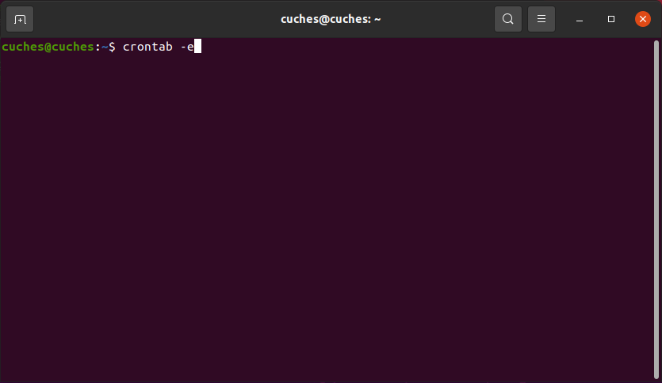
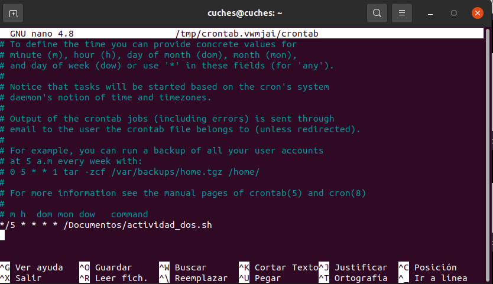

## ACTIVIDAD #2 

Para realizar la configuración del cronjob ejecute el siguiente comando para abrir el crontab  

`crontab -e`

Agregue la siguiente linea en el archivo 

`*/5 * * * * /Documentos/actividad_dos.sh`

Para verificar el contenido del log ejecute el siguiente comando 

`cat /tmp/<fecha>/saludos.log`

Para verificar que el cronjob se ejecute correctamente utilice el siguiente comando 

`grep actividad_dos /var/log/syslog`
