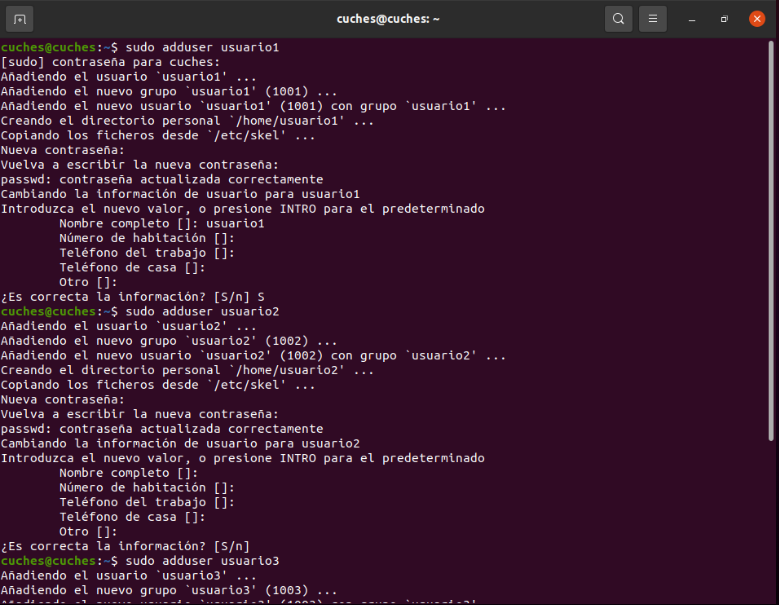
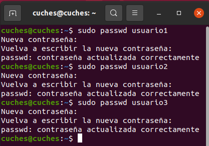
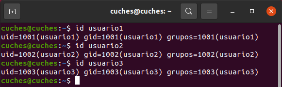
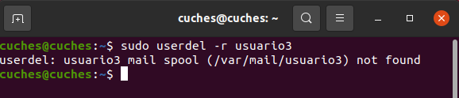
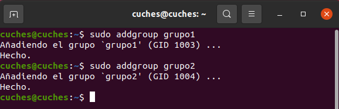
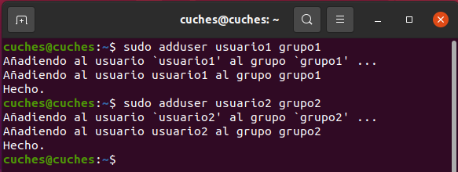
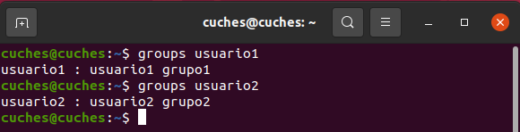
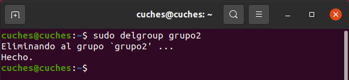

# Actividad #3 - Gestion de Permisos
## Parte #1: Gestion de usuarios
### Creacion de usuarios
`sudo adduser usuario1`
`sudo adduser usuario2`
`sudo adduser usuario3`

### Asignacion de contraseñas
`sudo passwd usuario1`
`sudo passwd usuario2`
`sudo passwd usuario3`

### Informacion de usuarios
`id usuario1`
`id usuario2`
`id usuario3`

### Eliminacion de usuarios
`sudo userdel -r usuario3`

## Parte #2: Gestion de grupos
### Creacion de grupos
`sudo addgroup grupo1`
`sudo addgroup grupo2`

### Agregar usuarios a grupos
`sudo adduser usuario1 grupo1`
`sudo adduser usuario2 grupo2`

### Verificar membresia
`groups usuario1`
`groups usuario2`

### Eliminar grupo
`sudo delgroup grupo2`

## Parte #3: Gestion de permisos
### Creacion de archivos y directorios
### Verificar permisos
### Modificar permisos usando chmod con modo numerico
### Modificar permisos usando chmod con modo simbolico
### Cambiar el grupo propietario
### Configurar permisos de directorio
### Comprobacion de acceso
### Verificacion final

## Preguntas
### ¿Por qué es importante gestionar correctamente los usuarios y permisos en un sistema operativo?
Porque podemos controlar quien puede acceder a que recursos y datos ya que es importante proteger la integridad y privacidad de la informacion. Tambien al asignar especificos a diferentes usuarios y grupos nos permite establecer roles y responsabilidades asi llevar un mejor control de accesos.

### ¿Qué otros comandos o técnicas conocen para gestionar permisos en Linux?
- El comando `chown` que cambia el propietario y el grupo de un archivo o directorio.

- El comando `chgrp` que cambia el grupo propietario de una archivo o directorio.

- El comando `umask` que establece una máscara de permisos predeterminada para nuevos archivos y directorios creados por un usuario.
